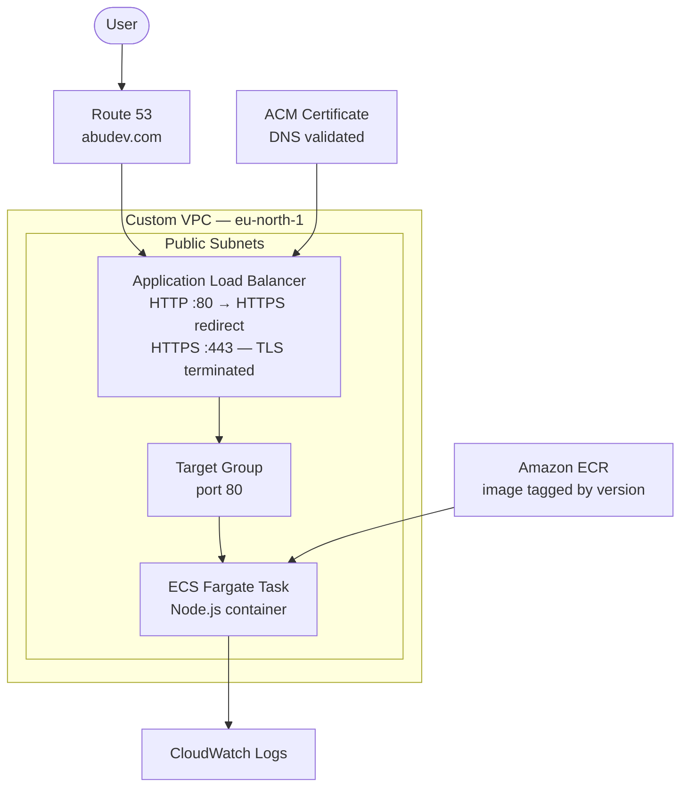

# AWS ECS Fargate - Containerised Application Deployment

A production-style deployment of a containerised Node.js application on AWS, served over HTTPS with a custom domain. Built first via the AWS Console (ClickOps) to understand the architecture, then fully rebuilt as infrastructure as code using Terraform.

**URL:** `https://tm.abudev.com`

---

## Architecture Overview



**Region:** `eu-north-1` (Stockholm)

---

## Stack

| Layer | Technology |
|---|---|
| Compute | AWS ECS Fargate |
| Container Registry | Amazon ECR |
| Load Balancer | Application Load Balancer (ALB) |
| TLS/HTTPS | AWS Certificate Manager (ACM) |
| DNS | Amazon Route 53 |
| Networking | Custom VPC, public subnets, security groups |
| IaC | Terraform |
| Logging | Amazon CloudWatch |
| CI/CD | GitHub Actions (OIDC) |

---

## Repository Structure

```
.
├── app/
│   └── index.js              # Node.js app (health endpoint)
├── Dockerfile                # Multi-stage build
├── .dockerignore
├── infra/
│   ├── provider.tf
│   ├── vpc.tf
│   ├── ecr.tf
│   ├── ecs.tf
│   ├── alb.tf
│   ├── acm.tf
│   ├── route53.tf
│   ├── iam.tf
│   ├── security_groups.tf
│   └── cloudwatch.tf
├── .github/
│   └── workflows/
│       └── deploy.yml
└── README.md
```

---

## Application

The Threat Composer app is a lightweight Node.js application exposing a `/health` endpoint.

```bash
# Verify locally
curl http://localhost:80/health
# {"status":"ok"}
```

---

## Docker

Multi-stage Dockerfile: builder stage compiles dependencies, runtime stage uses a minimal image with a non-root user.

```bash
# Build
docker build -t threatmod .

# Run locally
docker run -p 80:80 threatmod

# Verify
curl http://localhost:80/health
```

---

## Infrastructure (Terraform)

### Resources Provisioned

- **VPC** - custom VPC with two public subnets across availability zones
- **Security Groups** - ALB allows inbound 80/443; ECS tasks allow inbound from ALB only
- **ECR** - private container registry; images tagged by version
- **ALB** - HTTP listener redirects to HTTPS (301); HTTPS listener terminates TLS, forwards to target group
- **ACM Certificate** - DNS-validated certificate for `tm.abudev.com`
- **Route 53** - hosted zone for `abudev.com`; CNAME validation records; A record aliased to ALB
- **IAM** - ECS task execution role with ECR pull and CloudWatch write permissions

### ACM Validation Pattern

Certificate validation uses three resources:

```hcl
# 1. Request the certificate
resource "aws_acm_certificate" "main" { ... }

# 2. Write the DNS proof record Route 53
resource "aws_route53_record" "cert_validation" {
  for_each = {
    for dvo in aws_acm_certificate.main.domain_validation_options : dvo.domain_name => {
      name   = dvo.resource_record_name
      type   = dvo.resource_record_type
      record = dvo.resource_record_value
    }
  }
  ...
}

# 3. Wait for validation to complete
resource "aws_acm_certificate_validation" "main" { ... }
```

### Deploy

```bash
cd infra

terraform init
terraform plan
terraform apply
```

> **Note:** After the first `terraform apply`, update your domain registrar's nameservers to point to the Route 53 hosted zone. This is a one-time manual step — Route 53 outputs the nameservers.

---

## CI/CD (GitHub Actions)

The pipeline uses OIDC authentication - no static AWS credentials stored in GitHub.

**Workflow triggers:**
- Push to `main` — builds image, pushes to ECR, forces new ECS deployment
- `workflow_dispatch` — manual trigger

**Pipeline stages:**

1. Build Docker image, tag with commit SHA
2. Authenticate to AWS via OIDC
3. Push image to ECR
4. Update ECS service (force new deployment)
5. Post-deploy health check — `curl https://tm.abudev.com/health`

```bash
# Manual trigger
gh workflow run deploy.yml
```

---

## Phase 1 - ClickOps (Manual Baseline)

Before writing any Terraform, the entire stack was manually provisioned via the AWS Console:

- Created ECR repository and pushed the image
- Created ECS cluster, task definition, and Fargate service
- Provisioned an ALB with listeners and a target group
- Configured Route 53 and requested an ACM certificate
- Verified the app was reachable at `https://tm.abudev.com`
- Tore it all down

The purpose was to understand how every resource connects before abstracting it. Knowing what a task definition looks like in the console makes writing the Terraform resource significantly easier to reason about — and easier to debug when something doesn't work.

---

## Phase 2 - Infrastructure as Code (Terraform)

With a clear mental model from Phase 1, the entire stack was rebuilt in Terraform from scratch. No resource was carried over from ClickOps - everything was torn down and re-provisioned via code.

The rebuild covered:

- VPC, subnets, internet gateway, route tables
- Security groups (ALB inbound 80/443; ECS tasks inbound from ALB only)
- ECR repository
- ECS cluster, task definition, Fargate service
- ALB with HTTP → HTTPS redirect listener and HTTPS listener
- ACM certificate (DNS-validated via Route 53)
- Route 53 hosted zone, validation records, A record aliased to ALB
- IAM task execution role
- CloudWatch log group

The ClickOps → IaC progression is intentional. It reflects how production environments are often built: understand the architecture manually, then codify it so it's repeatable, reviewable, and version-controlled.

---

## Key Learnings

**ALB TLS termination** - HTTPS is terminated at the load balancer. Containers only receive plain HTTP on port 80. Both the HTTP redirect listener and the HTTPS listener point to the same target group.

**ACM DNS validation** - Three Terraform resources are required: the certificate request, the Route 53 CNAME record (using `for_each` over `domain_validation_options`), and the `aws_acm_certificate_validation` waiter. Skipping the waiter means subsequent resources referencing the cert ARN may fail.

**Fargate networking** - Tasks run in public subnets with `assign_public_ip = true` to pull images from ECR without a NAT gateway. Security groups restrict inbound to the ALB only.

**OIDC over static keys** - GitHub Actions authenticates to AWS via an OIDC identity provider. No long-lived credentials are stored. The trust policy scopes access to a specific repo and branch.

---

## Screenshots


---


